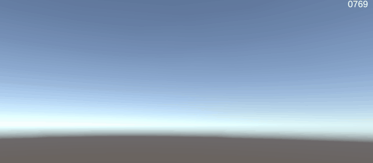

## Simple & Fast Unity FPS Counter



## Features
- NO GC Allocation (No String used)

## Dependencies
- Text Mesh Pro

## How to Use?
1. Simply Drag and drop `UIFastFPSCounter.prefab` to your game scene!

## How to Install?
1. Head over to Unity Package Manager
1. Click on "+" Icon
1. Select Add package from git url
1. Insert This URL 
```
https://github.com/StinkySteak/fast-fps-counter.git
```